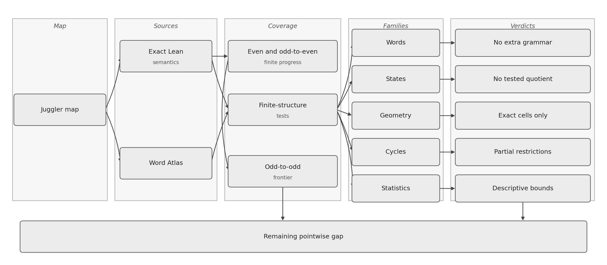

## Abstract

The Juggler map is the nonlinear integer map
\[
J(n)=
\begin{cases}
\lfloor\sqrt n\rfloor,&n\ \text{even},\\
\lfloor n^{3/2}\rfloor,&n\ \text{odd}.
\end{cases}
\]
It is conjectured that every positive integer eventually reaches \(1\).
We do not prove that conjecture.

We develop an exact finite-word calculus for the Juggler map. For every
parity word \(w\) realized at \(n\), the endpoint satisfies the power envelope
\[
J^{|w|}(n)^{2^{|w|}}\le n^{3^{\#O(w)}}.
\]
Hence \(3^{\#O(w)}<2^{|w|}\) forces \(J^{|w|}(n)<n\) whenever \(n\ge2\).
Local floor remainders lift through later exponents to an exact global
defect. We prove its identity, vanishing classification, and composition
law: concatenation is a two-term power-gap, and zero defect gives precisely
the rigid monochrome towers. Exact inverse cells then yield necessary cycle
restrictions, including superquadratic prefixes from a cycle minimum to
later even states and the exclusion of two explicit length-six words.

As a secondary application, every even start and every odd start whose first
image is even has a uniform one- or two-step descent certificate. A classical
discrepancy estimate
\[
\bigl|S_O(N)\bigr|\ll N^{5/6},\qquad
S_O(N)=\sum_{\substack{n\le N\\n\ {\rm odd}}}
(-1)^{\lfloor n^{3/2}\rfloor},
\]
implies that this uniform short-certificate class has density \(3/4\).
It is neither a density of all descent certificates nor a density of starts
that reach \(1\).

All finite-word statements are conditional on the realized itinerary. The
remaining pointwise question is whether almost every odd-to-odd start has
some finite descent; no such theorem is proved here.

## 1. Introduction

The Juggler sequence was introduced by Pickover [1]; see also OEIS A094683
[2]. Universal arrival at \(1\) remains open.

The map combines a contracting even branch with an expanding odd branch,
\[
E(n)=\lfloor n^{1/2}\rfloor,\qquad
O(n)=\lfloor n^{3/2}\rfloor.
\]
A word of length \(k\) with \(o\) odd letters has ideal exponent
\(3^o/2^k\). Floors are applied after every letter, and a word is available
only when the orbit realizes those parities. The paper records the exact
finite-word comparison, the compositional slack, the uniform short
certificates, and the density of the class those certificates cover.

The main contribution is the exact power-envelope and defect calculus,
together with its inverse-cell and cycle consequences. The
short-certificate density is a secondary corollary. We do not prove a
Collatz theorem or transfer Collatz stopping-time results to \(J\).

### 1.1 Verification convention

Theorems in Sections 2--4 are proved both below and in Lean under the names
listed at the start of each section. Theorem 5.1 is an ordinary human proof
and is not formalized. Proposition 4.4 is an exact Python-integer census,
not a theorem about an infinite set. No finite computation is used as a
termination proof.

### 1.2 Related maps

The nearest published comparison is the Collatz problem. Lagarias [3,4]
surveys parity words and almost-all statements short of totality. Terras [5]
and Everett [6] proved that almost every positive integer has a finite
Collatz stopping time; Tao [7] later showed that almost all Collatz orbits
attain almost bounded values. Those results are methodological cousins, not
theorems about \(J\). The Juggler analogue of Terras would be an almost-all
descent theorem on the odd-to-odd class.

Crandall [8] and Matthews–Watts [9] treat piecewise-affine Hasse–Syracuse
maps; the Juggler branches are floor powers, not affine. Prasad and Prasad
[12] estimate excursion and stopping constants for juggler-like random
walks; Section 6 keeps that comparison descriptive.

## 2. Finite words, envelope, and defect

Let \(\mathcal B=\{E,O\}\). A finite word \(w\in\mathcal B^*\) is
*realized* at \(n\in\mathbb N\) when the successive parities of the orbit
of \(n\) are exactly the letters of \(w\). Write \(J^{|w|}(n)\) for the
endpoint after those letters, and \(\#O(w)\) for the number of odd
letters.

The identities in this section are formalized in Lean
(`follows_iff_word`, `image_eq_iterate`, `image_append`,
`image_monotone_of_follows`, `power_bound_word`,
`power_bound_contracts`, `global_defect_identity`,
`global_defect_eq_zero_iff_localsTight`, `global_defect_append`,
`global_defect_eq_zero_implies_monochrome`,
`power_bound_eq_iff_extremal`). The proofs below are the ordinary
integer arguments.

**Theorem 2.1 (fixed-word monotonicity).**
If \(n\le m\) and both realize \(w\), then
\(J^{|w|}(n)\le J^{|w|}(m)\).

*Proof.* Induct on \(w\). The empty word is immediate. For the induction
step, the two current states realize the same next letter. On the even
branch, monotonicity follows from monotonicity of the integer square root;
on the odd branch it follows from monotonicity of \(x\mapsto x^3\) followed
by the integer square root. Apply the induction hypothesis to the prefix
and then the appropriate branch inequality. \(\square\)

The realizing set of a fixed word need not be an interval.

**Theorem 2.2 (finite-word power envelope).**
If \(w\) is realized at \(n\) and \(m=J^{|w|}(n)\), then
\[
m^{2^{|w|}}\le n^{3^{\#O(w)}}.
\]

*Proof.* Write \(k=|w|\) and \(o=\#O(w)\). The empty word is the equality
\(n\le n\). Suppose the bound holds at a realized prefix ending at
\(x\), and the next letter is realized.

If the next letter is even, then \(J(x)=\lfloor\sqrt x\rfloor\), so
\(J(x)^2\le x\). Raising the inductive bound to the second power gives
\[
J(x)^{2^{k+1}}=(J(x)^2)^{2^k}\le x^{2^k}\le n^{3^o}.
\]
The odd count is unchanged.

If the next letter is odd, then \(J(x)=\lfloor x^{3/2}\rfloor\), so
\(J(x)^2\le x^3\). Therefore
\[
J(x)^{2^{k+1}}=(J(x)^2)^{2^k}\le x^{3\cdot 2^k}=(x^{2^k})^3
\le\bigl(n^{3^o}\bigr)^3=n^{3^{o+1}}.
\]
This is the claimed bound after one more odd letter. \(\square\)

**Corollary 2.3 (exponent-gap contraction).**
If \(n\ge2\), \(w\) is realized at \(n\), and
\(3^{\#O(w)}<2^{|w|}\), then \(J^{|w|}(n)<n\).

*Proof.* Let \(m=J^{|w|}(n)\) and \(k=|w|\). Theorem 2.2 gives
\(m^{2^k}\le n^{3^{\#O(w)}}\). The exponent gap and \(n\ge2\) give
\(n^{3^{\#O(w)}}<n^{2^k}\), so \(m^{2^k}<n^{2^k}\). Since \(m\ge1\), one
has \(m<n\). \(\square\)

The corollary includes familiar contracting blocks such as \(OOOEE\). It
does not prove that every start realizes some contracting word.

The floor slack is exact, and it is not an additive path sum. For a
single branch,
\[
x^e=J(x)^2+\rho(x),\qquad
e=\begin{cases}1,&x\ {\rm even},\\3,&x\ {\rm odd},\end{cases}
\]
with \(0\le\rho(x)<2J(x)+1\). Write
\[
\operatorname{gap}(a,\rho,e)=(a+\rho)^e-a^e,
\]
so \(a^e+\operatorname{gap}(a,\rho,e)=(a+\rho)^e\). If \(e\ge1\), then
\(\operatorname{gap}(a,\rho,e)=0\) if and only if \(\rho=0\), and
\(\rho^e\le\operatorname{gap}(a,\rho,e)\).

Along a realized word \(w\), write \(x_0=n\) and \(x_{j+1}=J(x_j)\), and
let \(\rho_j=\rho(x_j)\). Define a running slack by \(D_0=0\) and
\[
D_{j+1}=
\begin{cases}
D_j+\operatorname{gap}(x_{j+1}^2,\rho_j,2^j),
& \text{next letter even},\\[4pt]
\operatorname{gap}(x_{j+1}^2,\rho_j,2^j)
+\operatorname{gap}(x_j^{2^j},D_j,3),
& \text{next letter odd}.
\end{cases}
\]
The *global defect* is \(\Delta_w(n)=D_{|w|}\). An even letter keeps the
old slack and lifts the new remainder through \(2^j\). An odd letter
first cubes the running slack and then lifts the new remainder. In
particular \(\Delta\) is not the sum of the local remainders.

**Theorem 2.4 (global defect identity).**
If \(w\) is realized at \(n\) and \(m=J^{|w|}(n)\), then
\[
n^{3^{\#O(w)}}=m^{2^{|w|}}+\Delta_w(n),\qquad\Delta_w(n)\ge0.
\]
Theorem 2.2 is the inequality \(\Delta_w(n)\ge0\).

*Proof.* The empty word is \(n=n+0\). Suppose a realized prefix of
length \(k\) with odd count \(o\) ends at \(x\) and satisfies
\(n^{3^o}=x^{2^k}+D\).

If the next letter is even, then \(x=J(x)^2+\rho(x)\), so
\[
n^{3^o}
=(J(x)^2+\rho(x))^{2^k}+D
=J(x)^{2^{k+1}}+D+\operatorname{gap}(J(x)^2,\rho(x),2^k).
\]
The odd count is unchanged, and the new slack is the even update.

If the next letter is odd, then \(x^3=J(x)^2+\rho(x)\). Cubing the
inductive identity gives
\[
n^{3^{o+1}}=(x^{2^k}+D)^3
=x^{3\cdot 2^k}+\operatorname{gap}(x^{2^k},D,3).
\]
The leading term is
\[
x^{3\cdot 2^k}
=(J(x)^2+\rho(x))^{2^k}
=J(x)^{2^{k+1}}+\operatorname{gap}(J(x)^2,\rho(x),2^k),
\]
which is the odd update. \(\square\)

**Theorem 2.5 (vanishing).**
If \(w\) is realized at \(n\), the following are equivalent.

1. \(\Delta_w(n)=0\).
2. Every local remainder along \(w\) vanishes.
3. \(J^{|w|}(n)^{2^{|w|}}=n^{3^{\#O(w)}}\).

In that case \(w\) is monochrome. More precisely, either \(w=E^k\) and
\(n=a^{2^k}\) for an even \(a\), or \(w=O^k\) and \(n=a^{2^k}\) for an
odd \(a\). A realized mixed word therefore has \(\Delta_w(n)>0\).

*Proof.* The identity of Theorem 2.4 gives (1)\(\Leftrightarrow\)(3).
For (1)\(\Leftrightarrow\)(2), use the recurrence. If \(e\ge1\), a
power-gap vanishes if and only if its addend vanishes. The even update
is a sum of two nonnegative terms, and the odd update is a sum of two
power-gaps; either vanishes only when the incoming slack and the new
remainder both vanish. Thus \(D_{|w|}=0\) forces \(D_0=0\) and every
\(\rho_j=0\). The converse is immediate.

If every remainder vanishes, an even step satisfies
\(x_j=x_{j+1}^2\), while an odd step satisfies
\(x_j^3=x_{j+1}^2\). In either case \(x_j\) and \(x_{j+1}\) have the
same parity, so the itinerary is monochrome. If \(w=E^k\), repeated
substitution gives \(n=x_k^{2^k}\); writing \(a=x_k\), its parity is
even. If \(w=O^k\), unique factorization applied to
\(x_j^3=x_{j+1}^2\) shows that every prime valuation of \(x_j\) is
divisible by \(2\). Iterating this valuation relation shows that every
prime valuation of \(n=x_0\) is divisible by \(2^k\), hence
\(n=a^{2^k}\) for an odd \(a\). Conversely, these even and odd towers
make every local remainder zero. This is the extremal classification
`power_bound_eq_iff_extremal`. \(\square\)

**Theorem 2.6 (composition).**
If \(u\) is realized at \(n\) and \(v\) is realized at
\(m=J^{|u|}(n)\), then
\[
\Delta_{uv}(n)
=
\operatorname{gap}\bigl(m^{2^{|u|}},\,\Delta_u(n),\,3^{\#O(v)}\bigr)
+
\operatorname{gap}\bigl(J^{|v|}(m)^{2^{|v|}},\,\Delta_v(m),\,2^{|u|}\bigr).
\]
In particular
\(\Delta_v(m)^{2^{|u|}}\le\Delta_{uv}(n)\). Every local remainder
satisfies \(\rho_j^{2^j}\le\Delta_w(n)\).

*Proof.* Write \(o_u=\#O(u)\) and \(o_v=\#O(v)\). Theorem 2.4 on \(u\)
and on \(uv\) gives
\[
n^{3^{o_u+o_v}}
=\bigl(m^{2^{|u|}}+\Delta_u(n)\bigr)^{3^{o_v}}
=J^{|uv|}(n)^{2^{|uv|}}+\Delta_{uv}(n).
\]
The first power expands as
\[
m^{2^{|u|}\cdot 3^{o_v}}
+\operatorname{gap}\bigl(m^{2^{|u|}},\,\Delta_u(n),\,3^{o_v}\bigr).
\]
Theorem 2.4 on \(v\) at \(m\) rewrites the leading term as
\[
\bigl(J^{|v|}(m)^{2^{|v|}}+\Delta_v(m)\bigr)^{2^{|u|}},
\]
which expands as the second gap plus \(J^{|uv|}(n)^{2^{|uv|}}\).
Comparing the two expressions for \(n^{3^{o_u+o_v}}\) yields the
identity. The suffix inequality is
\(\rho^e\le\operatorname{gap}(a,\rho,e)\) on the second summand. For a
local remainder at index \(j\), split \(w\) after \(j\) letters: the
suffix defect is at least \(\rho_j\), and raising through \(2^j\) gives
the stated bound. \(\square\)

Composition is polynomial, not additive: later odd letters raise the
prefix slack to the third power, and later letters of either parity
raise a suffix slack through \(2^{|u|}\). The naive recurrence
\(\Delta\leftarrow\Delta+\rho\) is false.

The identity does not supply a state-independent positive tax. On the
recorded finite window, some persistent expanding blocks have very small
normalized slack \(\Delta/n^{3^{\#O(w)}}\). The
inequality \(\Delta_w(n)>n^{3^{\#O(w)}}-n^{2^{|w|}}\) on a formally
expanding word is exactly \(J^{|w|}(n)<n\), so it does not forbid
mixed expanding prefixes.

## 3. Inverse cells and cycles

The exact one-step fibers are
\[
J(n)=q\iff q^2\le n<(q+1)^2
\quad(n\ {\rm even})
\]
and
\[
J(n)=m\iff m^2\le n^3<(m+1)^2
\quad(n\ {\rm odd}).
\]
An odd fiber contains at most one integer (`odd_cell_unique`). Indeed,
suppose \(a<b\) lie in the same odd cell indexed by \(m\). Then
\((a+1)^3\le b^3<(m+1)^2\) and \(m^2\le a^3\). Subtracting the latter
lower bound from the former upper bound gives
\[
3a^2+3a+1=(a+1)^3-a^3<(m+1)^2-m^2=2m+1,
\]
and hence \(3a^2\le2m\). If \(a=0\), then \(m=0\) and the displayed
strict inequality is already impossible. If \(a>0\), squaring and using
\(m^2\le a^3\) gives \(9a^4\le4m^2\le4a^3\), contradicting
\(4a^3<9a^4\). An even fiber is a parity-restricted square interval and
may contain many predecessors.

A nonempty realized word \(w\) with \(J^{|w|}(n)=n\) is a cycle word.

The identities in this section are formalized in Lean
(`cycle_word_formally_expanding`, `cycleMin_not_end_odd`,
`square_scale_superquadratic`, `cycleMin_to_even_superquadratic`,
`no_cycle_word_oooeoe`, `no_cycle_word_ooooee`). The proofs below are
the ordinary integer arguments.

**Theorem 3.1 (cycle restrictions).**
Let \(w\) be a cycle word at \(n\ge2\).

(i) The word is formally expanding:
\[
2^{|w|}<3^{\#O(w)}
\]
(`cycle_word_formally_expanding`). A contracting word cannot close a
nontrivial cycle.

(ii) The cycle minimum is odd and the cycle maximum is even. A
minimum-based orientation cannot end in an odd letter
(`cycleMin_not_end_odd`).

(iii) A realized word \(v\) is *superquadratic* if
\[
3^{\#O(v)}\ge 2^{|v|+1}.
\]
Any realized path from a start \(n\ge2\) to a state at least \(n^2\)
is superquadratic (`square_scale_superquadratic`). On a cycle minimum
the path to any later even state is superquadratic
(`cycleMin_to_even_superquadratic`). The prefix \(OOE\) is expanding
(\(9>8\)) but not superquadratic (\(9<16\)), so it cannot carry the
minimum to square scale.

*Proof.* For (i), Theorem 2.2 applied to a cycle endpoint gives
\(n^{2^{|w|}}\le n^{3^{\#O(w)}}\). Since \(n\ge2\), comparison of
exponents gives \(2^{|w|}\le3^{\#O(w)}\); equality is impossible because
the two sides have different prime divisors and \(|w|\ge1\).

Every state on such a cycle is at least \(2\): once an orbit reaches \(1\),
it remains there and cannot return to a start \(n\ge2\). An even state
\(x\ge2\) satisfies \(J(x)<x\), so a cycle minimum cannot be even. An odd
state \(x\ge3\) satisfies \(J(x)>x\), so a cycle maximum cannot be odd.
This proves the first assertion of (ii). For the final-letter assertion,
let \(x\) be the predecessor of a minimum-oriented return \(n\). If the
last letter were odd, the odd return cell would give
\(n^2\le x^3<(n+1)^2\). Minimality gives \(x\ge n\), hence
\(n^3<(n+1)^2\), impossible for \(n\ge3\); and the minimum is odd, so
\(n\ge3\).

For (iii), let a realized word \(v\) send \(n\) to \(y\ge n^2\).
Theorem 2.2 gives
\[
n^{2^{|v|+1}}=(n^2)^{2^{|v|}}
\le y^{2^{|v|}}\le n^{3^{\#O(v)}}.
\]
Since \(n\ge2\), comparison of exponents proves the superquadratic
inequality. On a cycle minimum, if a later state \(y\) is even, its
successor is at least \(n\). Thus \(n\le J(y)=\lfloor\sqrt y\rfloor\),
so \(n^2\le y\), and the preceding argument applies to that prefix.
\(\square\)

Two length-six orientations are nevertheless impossible, and they are
not an arbitrary pair. In a minimum-based orientation, Theorem 3.1
forces a length-six cycle word to start odd, end even, and be formally
expanding; that leaves \(OEOOOE\), \(OOEOOE\), \(OOOEOE\), \(OOOOEE\),
and \(OOOOOE\). The first fails the superquadratic test of
Theorem 3.1(iii), and the accompanying Lean development eliminates
\(OOEOOE\) and \(OOOOOE\) by odd-run and internal-even threshold
arguments (`no_cycleMin_ooeooe`, `no_cycle_odd_run_append_even`) not
reproduced here. \(OOOEOE\) and \(OOOOEE\) are the two survivors of
that elimination and require an individual argument, which uses the
last-even cell together with a coarse lower envelope. No census of all
length-six words, or of all cycles, is claimed.

For \(n\ge1\),
\[
n<4\,\lfloor\sqrt n\rfloor^2,
\]
so an even step satisfies \(n\le 4\,J(n)^2\) and an odd step satisfies
\(n^3\le 4\,J(n)^2\). Composing along a realized word \(v\) of length \(k\) with odd count
\(o\) gives
\[
n^{3^{o}}\le D_v\,J^{k}(n)^{2^{k}}.
\]
The denominator starts at \(1\) and updates by
\(D\mapsto D\cdot 4^{2^{j}}\) on an even letter and
\(D\mapsto D^{3}\cdot 4^{2^{j}}\) on an odd letter, at step \(j\).
In particular \(D_{OOO}=2^{38}\) and \(D_{OOOO}=2^{130}\). If a cycle word ends
in an even letter, the last-even cell is
\(J^{|w|-1}(n)<(n+1)^2\).

**Theorem 3.2 (two length-six exclusions).**
Neither \(OOOEOE\) nor \(OOOOEE\) is a cycle word at any \(n\ge2\).

*Proof.* First, if \(n\ge256\), then
\[
n^{81}>2^{130}(n+1)^{64}.
\]
Indeed \(257^{64}<2\cdot256^{64}\) and \(256(n+1)\le257\,n\), so
\((n+1)^{64}<2n^{64}\). Then
\(2^{130}(n+1)^{64}<2^{131}n^{64}\). Since \(n\ge256=2^8\), one has
\(n^{17}\ge2^{136}\), and therefore
\(2^{131}n^{64}<2^{136}n^{64}\le n^{81}\).

For \(n<256\), neither word returns to its start. Lean checks both
itinerary-and-return tables by `native_decide` on `Fin 256`; the same
mechanism also verifies the finite numerical inequality
\(257^{64}<2\cdot256^{64}\) used at the cutoff.

Now suppose \(n\ge256\) realizes \(OOOOEE\), and write
\(z=J^4(n)\) for the image after the prefix \(OOOO\). The last two
even letters give \(J(z)<(n+1)^2\) and \(z<(J(z)+1)^2\), hence
\(z<(n+1)^4\). The lower envelope on \(OOOO\) is
\(n^{81}\le2^{130}z^{16}\), so
\(n^{81}<2^{130}(n+1)^{64}\), contradicting the tail inequality.

Finally suppose \(n\ge256\) realizes \(OOOEOE\). Write
\(z_3=J^3(n)\) and \(y=J(z_3)=\lfloor\sqrt{z_3}\rfloor\), so
\(z_3<(y+1)^2\). The lower envelope on \(OOO\) is
\(n^{27}\le2^{38}z_3^8<2^{38}(y+1)^{16}\). Cubing yields
\(n^{81}<2^{114}(y+1)^{48}\). The last letters \(OE\) give the odd-cell
bound \(y^3<(n+1)^4\). Write \(A=n+1\ge257\). Then
\((y+1)^3<2A^4\): if \(y\le A\), this follows from
\((A+1)^3<2A^4\); if \(y>A\), then \(y\ge4\) and
\((y+1)^3=y^3+3y^2+3y+1<A^4+4y^2\), while \(4y^2<A^4\) because
\(4y^3<4A^4\le yA^4\). Raising \((y+1)^3<2A^4\) to the sixteenth
power gives \((y+1)^{48}<2^{16}(n+1)^{64}\). Combining with the cubed
lower envelope produces again \(n^{81}<2^{130}(n+1)^{64}\). \(\square\)

## 4. Short descent certificates

A start \(n\ge2\) has a *descent certificate* if there exists a realized
finite word \(w\) with \(J^{|w|}(n)<n\), or with image \(1\). Lean
packages this predicate as `FiniteProgress`, an abbreviation of
`DescentCertificate`. The four constructors of that type are proof forms
of the same predicate, not four different claims. The predicate is
existential over all finite words, not only over words of length one or
two.

The theorems in this section are formalized in Lean
(`even_finiteProgress`, `odd_even_finiteProgress`,
`unresolved_is_odd_odd`, `reachesOne_of_all_finiteProgress`,
`reachesOne_of_lt_twelve`, `even_lt_sq_twelve_reachesOne`). The proofs
below are the ordinary integer arguments. Proposition 4.4 is the exact
census of Section 1.1, not a Lean theorem.

**Theorem 4.1 (uniform short certificates).**
Let \(n\ge2\).

1. If \(n\) is even, then the one-letter word \(E\) is a descent
   certificate: \(J(n)=\lfloor\sqrt n\rfloor<n\).
2. If \(n\) is odd and \(J(n)\) is even, then the two-letter word \(OE\)
   is a descent certificate.

*Proof.* For (1), \(\lfloor\sqrt n\rfloor\le\sqrt n<n\) for \(n\ge2\).
For (2), the word \(OE\) is realized by hypothesis, and
\[
J^2(n)=\bigl\lfloor\sqrt{\lfloor n^{3/2}\rfloor}\bigr\rfloor
\le n^{3/4}<n
\]
for \(n\ge2\). \(\square\)

**Theorem 4.2 (unresolved starts are odd-to-odd).**
If \(n\ge2\) has no descent certificate, then \(n\) is odd and \(J(n)\)
is odd.

*Proof.* Contrapositive of Theorem 4.1: an even start and an
odd-to-even start each carry a short certificate. \(\square\)

The converse is false: many odd-to-odd starts descend after a longer
word.

If every start above \(1\) has some descent certificate, ordinary strong
induction yields arrival at \(1\) (`reachesOne_of_all_finiteProgress`).
The hypothesis is not proved. A certificate at \(n\) only reduces the
problem to a strictly smaller positive integer, which may itself be
odd-to-odd.

Lean also certifies a finite landing class:

**Theorem 4.3 (small residuals).**
Every \(y\in\{1,\ldots,11\}\) reaches \(1\). Consequently every even
residual strictly below \(144=12^2\) reaches \(1\).

*Proof.* The orbits are finite and merge quickly:
\(2\to1\), \(4\to2\), \(6\to2\), \(8\to2\),
\(3\to5\to11\to36\to6\), \(7\to18\to4\),
\(9\to27\to140\to11\), and \(10\to3\). Each chain ends on a start
already settled, so every \(y\le11\) reaches \(1\). For the second claim, an even
\(y<144\) has \(J(y)=\lfloor\sqrt y\rfloor\le11\), which lands in the
verified set. (Lean evaluates the same finite orbits in
`reachesOne_of_lt_twelve` and `even_lt_sq_twelve_reachesOne`.)
\(\square\)

This enlarges the set of fatal landings for a hypothetical minimal
counterexample.

On the complementary odd-to-odd class, first return below the start is
frequent at a short horizon, but not automatic.

**Proposition 4.4 (odd-to-odd first-return census).**
For starts \(2\le n\le N\) and horizon \(20\), write \(\mathrm{OO}\) for
the odd-to-odd starts in that range. The exact census is:

| \(N\) | \(\#\mathrm{OO}\) | OO first return \(\le20\) | all starts, first return \(\le20\) |
|------:|------------------:|--------------------------:|-----------------------------------:|
| \(10^3\) | \(252\) | \(221/252\) (\(0.877\)) | \(968/999\) (\(0.969\)) |
| \(10^4\) | \(2504\) | \(2220/2504\) (\(0.887\)) | \(9715/9999\) (\(0.972\)) |
| \(10^5\) | \(24984\) | \(22379/24984\) (\(0.896\)) | \(97394/99999\) (\(0.974\)) |
| \(10^6\) | \(249926\) | \(223683/249926\) (\(0.895\)) | \(973756/999999\) (\(0.974\)) |

At \(N=10^6\), \(26{,}243\) odd-to-odd starts have no return below the
start in \(20\) steps. These rows use exact Python integer arithmetic with
no size cutoff through step \(20\); the unresolved count is zero in every
row. They are not Lean-certified and do not constitute an almost-all
theorem.

## 5. Ambient discrepancy and the short-certificate class

For odd \(n\) write \(s(n)=(-1)^{\lfloor n^{3/2}\rfloor}\) and
\[
S_O(N)=\sum_{\substack{n\le N\\n\ {\rm odd}}}s(n).
\]
Let \(M(N)\) be the number of odd integers \(n\le N\), and let
\[
\operatorname{OO}(N)=\#\{n\le N:\ n\ \mathrm{odd},\ J(n)\ \mathrm{odd}\}.
\]
Then \(s(n)=-1\) if and only if \(J(n)\) is odd, and
\[
S_O(N)=M(N)-2\operatorname{OO}(N).
\]
Also \(M(N)=N/2+O(1)\).

The floor sign has an exact fractional-part form. Write
\(x=\lfloor x\rfloor+\{x\}\). If \(\lfloor x\rfloor\) is even then
\(\{x/2\}<1/2\); if \(\lfloor x\rfloor\) is odd then
\(\{x/2\}\ge1/2\). Thus
\[
\lfloor x\rfloor\ \text{is odd}
\quad\Longleftrightarrow\quad
\{x/2\}\ge\tfrac12.
\]
For odd \(n=2r+1\) set
\[
g(r)=\frac{(2r+1)^{3/2}}2.
\]
Then \(s(n)=-1\) if and only if \(\{g(r)\}\ge1/2\). For \(R\) points
\(x_0,\ldots,x_{R-1}\) and an interval \(I\subset[0,1)\), define the
unnormalized interval discrepancy
\[
\mathcal D_R(I)=\#\{0\le r<R:\{x_r\}\in I\}-R|I|.
\]
Taking \(R=M(N)\), the odd integers at most \(N\) are exactly
\(2r+1\) for \(0\le r<R\), and therefore
\(S_O(N)=-2\mathcal D_R([1/2,1))\) for \(x_r=g(r)\).

The following two lemmas are classical. The derivative estimate is the
\(k=2\) case of Iwaniec--Kowalski [11, Thm. 8.20, Sec. 8.3,
pp. 204--213]. The discrepancy inequality is
Kuipers--Niederreiter [10, Ch. 2, Sec. 2, Thm. 2.5, pp. 112--115].

**Lemma 5.A (van der Corput, second-derivative form).**
Let \(f\) be twice differentiable on an interval of length \(M\), with
\(\lambda\le|f''|\le\alpha\lambda\) for some \(\alpha\ge1\). Then
\[
\Bigl|\sum e(f)\Bigr|\ll_\alpha M\lambda^{1/2}+\lambda^{-1/2},
\]
where the sum runs over the integers in the interval and
\(e(t)=e^{2\pi it}\).

**Lemma 5.B (Erdős–Turán).**
The discrepancy of \(R\) points \(x_j\in\mathbb R/\mathbb Z\) against an
interval satisfies
\[
D
\ll
\frac{R}{H}+\sum_{h=1}^H\frac1h\Bigl|\sum_{j=1}^R e(hx_j)\Bigr|
\]
for every cutoff \(H\ge1\).

**Theorem 5.1 (ambient odd-input discrepancy).**
\[
|S_O(N)|\ll N^{5/6}.
\]
This argument is not packaged in Lean.

*Proof.* The second derivative is
\[
g''(r)=\tfrac32(2r+1)^{-1/2}.
\]
It is positive and decreasing. Separate the initial term \(r=0\), then
partition \(1\le r<R\) into blocks
\([M,\min(2M,R))\), where \(M\) runs over powers of \(2\). On such a
block \(g''(r)\asymp M^{-1/2}\). For the \(h\)-th Fourier mode take
\(f=hg\), so \(\lambda\asymp hM^{-1/2}\). Lemma 5.A gives
\[
\Bigl|\sum_{r\asymp M}e(hg(r))\Bigr|
\ll h^{1/2}M^{3/4}+h^{-1/2}M^{1/4}.
\]
Lemma 5.B, with \(R\asymp M\), bounds that block's contribution to
\(S_O(N)\) by
\[
\frac{M}{H}+M^{3/4}H^{1/2}+M^{1/4}.
\]
Here the middle term is
\(\sum_{h\le H}h^{-1}\cdot h^{1/2}M^{3/4}\ll M^{3/4}H^{1/2}\), and the
last term is
\(\sum_{h\le H}h^{-1}\cdot h^{-1/2}M^{1/4}\ll M^{1/4}\).
For bounded \(M\), the trivial estimate is absorbed into the constant.
Otherwise choose \(H=\lfloor M^{1/6}\rfloor\), which balances the first
two terms at \(M^{5/6}\). The initial term contributes \(O(1)\), and the
geometric sum of the block bounds is
\(\sum_{M\le R}O(M^{5/6})=O(R^{5/6})=O(N^{5/6})\).
The floor sign is not replaced by a single exponential; the exponential
sums are those of the sequence \(\{g(r)\}\). \(\square\)

**Corollary 5.2 (short-certificate class).**
The odd-to-odd starts have natural density \(1/4\):
\[
\bigl|\operatorname{OO}(N)-N/4\bigr|\ll N^{5/6}.
\]
Equivalently, the starts that admit the uniform one- or two-step
certificates of Theorem 4.1 — every even start together with every
odd-to-even start — have natural density \(3/4\).

This is a density of the uniform short-certificate class of Theorem 4.1,
not of all descent certificates and not of starts that reach \(1\).

The exact census through \(N=10^7\) has
\(\operatorname{OO}(N)/N=0.2499896\). Through \(N=10^6\) one has
\(S_O(N)=146\) and running maximum \(256\), at \(n=985351\). A spot
computation at \(10^7\) has running maximum \(459\). The observed growth
is much smaller than \(N^{5/6}\): the recorded maxima at \(10^6\) and
\(10^7\) sit near the scale \(N^{1/3}\). That empirical scale is an
observation, not a theorem.

Theorem 5.1 concerns consecutive source intervals. It supplies no transfer
theorem for orbit samples or sparse image sets, so it cannot by itself
control the odd-to-odd dynamics after the first step.

## 6. The remaining gap

Theorem 4.1 and Corollary 5.2 together say that a uniform one- or
two-step argument covers a set of density \(3/4\). The first odd-to-odd
image expands, so ordinary strong induction cannot fire on that class.
Proposition 4.4 shows that most odd-to-odd starts in a finite window
still return below the start inside twenty steps. That is an
observation, not Terras's theorem for \(J\).

A mixed-parity heuristic, ignoring floors, gives mean log-log drift
\(\tfrac12\log(3/4)<0\). Finite ensembles sit near this value; hard
paths are more odd-rich. This agrees qualitatively with the
juggler-like random-walk model of Prasad and Prasad [12]. Fair parity
is an assumption, not a dynamical theorem, and typical negative drift
is not pointwise contraction.

The gap is therefore:

> No theorem forces every exact integer state into a contracting
> prefix. In particular, it is open whether almost every odd-to-odd
> start has a finite descent certificate.

{width=100%}

That is the Juggler form of the Terras question. A sharper ambient
discrepancy exponent does not answer it.

## 7. Software archive

Lean proofs of the exact-arithmetic theorems live at
[https://github.com/sneakyweasel/balanced_ternary/](https://github.com/sneakyweasel/balanced_ternary/).
The archive is not required to read the arguments above. Theorem 5.1 is
a human proof; Lean does not certify it.

From a clone, the review object is

```text
cd formal && lake build Problems.JugglerPaper
```

## Acknowledgments

I used large language models extensively while drafting and revising the
text, organizing companion notes, and as an interactive assistant for
Lean statements, tests, and literature records. The models are not
authors. Lean theorems and named computations are the certificates for
those claims. The discrepancy bound (Theorem 5.1) is a human proof using
classical analytic inequalities; it is not Lean-certified. I take full
responsibility for the contents.

## References

1. C. A. Pickover, *Computers and the Imagination: Visual Adventures Beyond
   the Edge*, St. Martin's Press, New York, 1991, ch. 40, p. 232.
2. OEIS Foundation Inc., “Juggler sequence: if \(n\) even then
   \(\lfloor\sqrt n\rfloor\) else \(\lfloor n^{3/2}\rfloor\),”
   Sequence A094683 in *The On-Line Encyclopedia of Integer Sequences*,
   https://oeis.org/A094683 (accessed 28 August 2026).
3. J. C. Lagarias, “The \(3x+1\) problem and its generalizations,”
   *Amer. Math. Monthly* 92 (1985), 3–23.
   [doi:10.1080/00029890.1985.11971528](https://doi.org/10.1080/00029890.1985.11971528).
4. J. C. Lagarias (ed.), *The Ultimate Challenge: The \(3x+1\) Problem*,
   American Mathematical Society, Providence, RI, 2010.
5. R. Terras, “A stopping time problem on the positive integers,”
   *Acta Arith.* 30 (1976), 241–252.
   [doi:10.4064/aa-30-3-241-252](https://doi.org/10.4064/aa-30-3-241-252).
6. C. J. Everett, “Iteration of the number-theoretic function
   \(f(2n)=n\), \(f(2n+1)=3n+2\),” *Adv. Math.* 25 (1977), 42–45.
   [doi:10.1016/0001-8708(77)90087-1](https://doi.org/10.1016/0001-8708(77)90087-1).
7. T. Tao, “Almost all orbits of the Collatz map attain almost bounded
   values,” *Forum Math. Pi* 10 (2022), e12.
   [doi:10.1017/fmp.2022.8](https://doi.org/10.1017/fmp.2022.8).
8. R. E. Crandall, “On the ``\(3x+1\)'' problem,” *Math. Comp.* 32
   (1978), 1281–1292.
   [doi:10.1090/S0025-5718-1978-0480321-3](https://doi.org/10.1090/S0025-5718-1978-0480321-3).
9. K. R. Matthews and A. M. Watts, “A generalization of Hasse's
    generalization of the Syracuse algorithm,” *Acta Arith.* 43 (1984),
    167–175.
    [doi:10.4064/aa-43-2-167-175](https://doi.org/10.4064/aa-43-2-167-175).
10. L. Kuipers and H. Niederreiter, *Uniform Distribution of Sequences*,
    Wiley-Interscience, New York, 1974.
11. H. Iwaniec and E. Kowalski, *Analytic Number Theory*, American
    Mathematical Society Colloquium Publications 53, Providence, RI, 2004.
12. V. Prasad and M. A. Prasad, “Estimates of the maximum excursion
    constant and stopping constant of juggler-like sequences,”
    ResearchGate preprint, 2025.
    [doi:10.13140/RG.2.2.14110.04168](https://doi.org/10.13140/RG.2.2.14110.04168).
