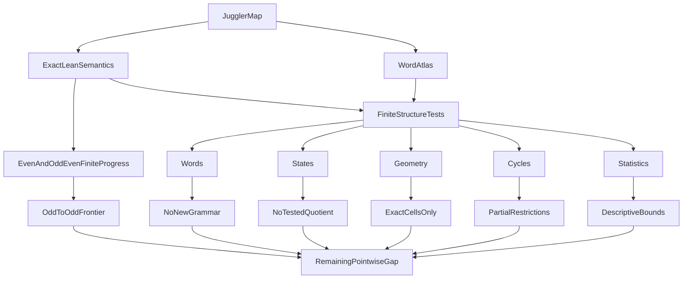

# Lean-Certified Finite Dynamics, a Word Atlas, and the Juggler Finite-Progress Boundary

**Status:** publication draft.

## Abstract

The Juggler map is the nonlinear integer map
\[
J(n)=
\begin{cases}
\lfloor\sqrt n\rfloor,&n\ \text{even},\\
\lfloor n^{3/2}\rfloor,&n\ \text{odd}.
\end{cases}
\]
It is conjectured that every positive integer eventually reaches \(1\).
We do not prove that conjecture.

We instead give a unified formal and computational account of finite Juggler
dynamics. In Lean we formalize iteration, parity itineraries, word realization,
word images, exact floor defects, residual steps, inverse cells, finite-progress
certificates, cycle predicates, and conditional contraction. The central
finite-word estimate is
\[
J^{|w|}(n)^{2^{|w|}}\le n^{3^{\#O(w)}},
\]
for every word \(w\) realized at \(n\); hence
\(3^{\#O(w)}<2^{|w|}\) implies \(J^{|w|}(n)<n\) for \(n\ge2\).
An exact global-defect identity records the slack in this envelope.

We pair the formal layer with a CPU/GPU Word Atlas that records bounded
realizers, arithmetic metadata, continuations, factors, and certified
persistent-expanding blocks. The Atlas is used as a reproducible apparatus for
testing symbolic, state, geometric, inverse, extremal, and statistical
reductions. Several exact structures survive: fixed-word images are monotone
on realizing sets, odd inverse cells are unique while even inverse cells are
not, and nontrivial cycle words obey strong exponent, parity, order, and cell
constraints. Several natural stronger reductions fail, with explicit or
Lean-certified counterexamples.

Finally, for the ambient odd-input sign sequence
\[
S_O(N)=\sum_{\substack{n\le N\\n\ {\rm odd}}}
(-1)^{\lfloor n^{3/2}\rfloor},
\]
a classical van der Corput--Erdős--Turán argument gives
\(|S_O(N)|\ll N^{5/6}\). This cancellation does not automatically transfer to
sparse Juggler-generated image sets. Taken together, the results locate a
finite-progress boundary: finite and statistical contraction are structured
and testable, but no pointwise all-state induction or universal exclusion of
exceptional trajectories is obtained.

## 1. Introduction

The Juggler sequence was introduced as a computational integer-dynamics
problem by Pickover [1]. Its apparent convergence is recorded, for example, in
OEIS A007320 [2], but universal convergence remains open.

The map combines a strongly contracting even branch with an expanding odd
branch:
\[
E(n)=\lfloor n^{1/2}\rfloor,\qquad
O(n)=\lfloor n^{3/2}\rfloor.
\]
The exponents suggest a simple multiplicative model. A word of length \(k\)
with \(o\) odd letters has ideal exponent \(3^o/2^k\). Floors, however, are
applied after every letter, and realizability depends on the exact integer
state. The tension between exponent arithmetic and iterated floor geometry is
the subject of this paper.

Our approach is:
\[
\boxed{
\text{formalize}\longrightarrow
\text{interrogate finite dynamics}\longrightarrow
\text{retain exact structure}\longrightarrow
\text{eliminate false reductions}\longrightarrow
\text{isolate the gap}.
}
\]

The contribution is not a collection of unsuccessful attacks. It is a
theorem-and-certificate map of finite Juggler dynamics:

1. a unified Lean formalization of the finite objects used in symbolic,
   residual, inverse, and cycle arguments;
2. a reusable Word Atlas with independent exact-reference and native
   validation paths;
3. exact finite-word envelope, defect, monotonicity, inverse-cell, and cycle
   results;
4. reproducible counterexamples to specified stronger compression laws;
5. an analytic discrepancy theorem for the ambient expanding branch, together
   with a precise explanation of why it does not yet become an orbit theorem.

The central qualified conclusion is:

> Finite Juggler dynamics admit a rich formal and computational description,
> but the symbolic, residual, geometric, inverse, extremal, and statistical
> compressions tested here do not yield a pointwise termination mechanism.

This says neither that the map is irreducible nor that every possible
finite-state reduction must fail.

### 1.1 Evidence discipline

We distinguish five kinds of statements used in the paper.

- **EXACT — LEAN VERIFIED:** a theorem checked by Lean.
- **EXACT — HUMAN PROOF:** a mathematical argument not packaged in Lean.
- **COMPUTATIONALLY VERIFIED:** an exact finite computation under stated
  bounds and validation conditions.
- **OBSERVATION:** a descriptive pattern in finite data.
- **REFUTED:** a universal candidate statement killed by a certificate or
  counterexample.

A missing word in a bounded Atlas is only `NOT OBSERVED WITHIN SEARCH BOUND`.
A finite check is never called a termination proof.

## 2. Exact finite semantics in Lean

The formal development is located in `formal/Problems/Juggler/`. Its detailed
theorem map is given in the
[formalization companion](juggler_finite_dynamics_formalization.md).

### 2.1 Itineraries and images

Let \(\mathcal B=\{E,O\}\). For \(n\in\mathbb N\) and a finite word
\(w\in\mathcal B^*\), `follows n w` means that the successive parities of the
orbit of \(n\) are exactly the letters of \(w\), and `image n w` is the
endpoint after those letters.

The formal bridge is:
\[
\operatorname{follows}(n,w)
\quad\Longleftrightarrow\quad
\operatorname{word}(n,|w|)=w.
\]
This is `follows_iff_word`. Theorems `image_eq_iterate` and `image_append`
prove
\[
\operatorname{image}(n,w)=J^{|w|}(n),\qquad
\operatorname{image}(n,uv)=
\operatorname{image}(\operatorname{image}(n,u),v).
\]
Thus the symbolic layer is definitionally tied to the integer orbit rather
than to an idealized exponent model.

One useful surviving property is exact fixed-word monotonicity.

**Theorem 2.1 (fixed-word monotonicity; EXACT — LEAN VERIFIED).**
If \(n\le m\), and both \(n\) and \(m\) realize \(w\), then
\[
J^{|w|}(n)\le J^{|w|}(m).
\]

This is `image_monotone_of_follows`. The restriction to a common realizing
word is essential; the theorem does not assert that the realizing set is an
interval.

### 2.2 Defects and residuals

For a single branch, the floor loss can be written exactly as
\[
x^e=J(x)^2+\rho(x),
\qquad
e=\begin{cases}1,&x\ {\rm even},\\3,&x\ {\rm odd},\end{cases}
\]
with \(0\le\rho(x)<2J(x)+1\). The formal development lifts these local
remainders through a word into `globalDefect`.

Residual steps package realized blocks \(O^aE^b\), \(b\ge1\), and distinguish
ordinary return below a start from persistent expansion. These are relations
on exact integers, not transitions on a proposed compressed state.

### 2.3 Cells and cycles

The exact one-step inverse cells are
\[
J(n)=q\iff q^2\le n<(q+1)^2
\quad(n\ {\rm even})
\]
and
\[
J(n)=m\iff m^2\le n^3<(m+1)^2
\quad(n\ {\rm odd}).
\]
They are formalized as `even_cell_iff` and `odd_cell_iff`. The cycle layer
defines `CycleWord`, cycle minima and maxima, distinguished peak and return
states, and exact remainder balances. All cycle theorems in this paper are
conditional restrictions. No theorem in the development excludes every
nontrivial cycle.

## 3. The Word Atlas

The Word Atlas is a finite census indexed by words:
\[
w\longleftrightarrow
\{\text{realizers, arithmetic metadata, continuations, derived properties}\}.
\]
Its role is methodological. It is not merely a larger trajectory search, and
it does not infer a global language from bounded absence.

### 3.1 Stored objects

The versioned schema separates:

1. **words:** packed bits, length, odd/even counts, run signature, and exponent
   surplus or deficit;
2. **realizers:** minimum observed realizer, endpoint, and expanding-realizer
   status;
3. **continuations:** the observed successor mask in the rooted prefix trie;
4. **factors and PE records:** language-qualified factors and exact host-side
   persistent-expanding classifications.

Experiment metadata and checksums bind these tables to a configured search
window and backend. The `REALIZABLE` factor table stores rooted prefixes;
interior substrings are queried separately. This distinction prevents a prefix
gap from being reported as a forbidden factor.

### 3.2 Native and exact-reference paths

Kernel A enumerates starts and uses packed words plus `atomicMin` to retain
minimum observed realizers. Native wide-integer overflow is explicit: affected
starts are exported and replayed by the Python exact reference. Persistent
expansion is classified in a host post-pass using the repository's exact
integer predicates; the GPU does not certify PE by proxy.

Validation has three layers:

- fixed fixtures aligned with Lean, including `OOE` and persistent residual
  chains;
- a Python exact census and metadata recomputation;
- native CPU/GPU comparison against the exact reference, allowing only
  explicitly replayed overflow cases.

The resulting artifacts are SQLite/Parquet tables, a manifest, checksums, and
a compact scientific summary.

### 3.3 Scientific census

The principal stored experiment is
`wa-20260827T200310Z-cuda-k20-n100000000`, with
\[
k\le20,\qquad n\le10^8,
\]
and a host PE scan through \(10^7\). At length \(20\), 132,398 of the
\(2^{20}\) words were observed as rooted prefixes. The first incomplete length
was \(6\), where `EEEEEE`, `EEEEOE`, and `EEEOEO` were not observed as rooted
prefixes. They are not forbidden words: `EEEEEE`, for example, occurs as an
interior factor in stored length-\(20\) trajectories.

The host scan produced 715,855 `PE_CERTIFIED` blocks and 9,832 distinct PE-run
words. For factor lengths \(r\le8\), every factor allowed by the already known
\(O^aE^b\) block grammar was observed. This is
**COMPUTATIONALLY VERIFIED** only within the stated window. It did not produce
a new grammar theorem.

## 4. Structural interrogation

The Atlas and the exact Python probes were used to test families of reductions.
The curated decisions and source records are listed in the
[branch ledger](../juggler_branch_ledger.md).

### 4.1 Symbolic compression

PE factor complexity, realization tries, and continuation graphs were tested
for a smaller forbidden-factor or finite-continuation law. Within the Atlas
window, PE-run factors matched the known concatenations of \(O^aE^b\) blocks
and yielded no additional grammar. Rooted unary corridors were explained by
scale and landing parity; they did not become global prohibitions.

The exact language does retain useful algebra: realizability is stable under
factors, word images compose, and the existential expanding language differs
from the syntactic exponent language. What failed was the stronger reduction
from these facts to a finite progress law.

### 4.2 State compression

Residual projections based on parity, incoming odd-run length, exponent gap,
local remainder, and cell type were tested against future residual behavior.
Whenever a tested quotient had nontrivial fibers, examples with equal
compressed data and different future constraints appeared, or the apparently
predictive tuple was injective only because it still encoded the current
integer.

Future equivalence and short-horizon information-complexity probes reached the
same boundary: finite samples can collapse, but the collapse either repackages
the deterministic current state or depends on the chosen horizon. The
defensible conclusion is not “the exact integer is universally necessary.”
It is:

\[
\boxed{\text{No proper predictive quotient survived among the tested state families.}}
\]

### 4.3 Geometric and inverse compression

Realizing sets, endpoint images \(Y_w\), inverse cells, cell huts, and floor
boundaries were tested for convexity, interval structure, or a bounded inverse
type. Exact cells survive, but their asymmetry works against a simple quotient:
even inverse cells are long square intervals, whereas an odd inverse cell
contains at most one integer (`odd_cell_unique`).

Iterating the cells did not create a new rank beyond the forward itinerary.
The Lean theorem `ooe_cylinder_both_next_parities` gives a particularly sharp
separator: starts \(3461\) and \(3803\) realize `OOE` cylinders whose next
landings have opposite parity. The tested cylinder summary is therefore not a
complete next-parity state.

### 4.4 Global finite-path compression

Finite-word boundaries, first-return summaries, adversarial paths,
accelerations, and extremal controls were tested for a uniform finite descent
bound. They organize finite behavior but do not exclude every long
odd-dominated path. Acceleration repackages the same exact blocks. Extremal
frontiers describe ideal words, but admissible extremal words need not be
realized uniformly.

The explicit Lean certificate
\[
365\xrightarrow{OOE}763\xrightarrow{OOE}1749
\]
(`two_block_ooe_365`) refutes the natural claim that one persistent expanding
residual block must be followed by contraction. Longer finite expanding chains
are also recorded. These examples refute finite block laws; they do not
construct a nonterminating orbit.

Across the four themes the common, qualified result is that exact integer
dependence survives the reductions that were actually tested.

## 5. Exact finite contraction structure

Let \(w\) be a realized word of length \(k\), with \(o=\#O(w)\), and let
\(m=J^k(n)\).

**Theorem 5.1 (finite-word power envelope; EXACT — LEAN VERIFIED).**
\[
m^{2^k}\le n^{3^o}.
\]

The proof is compositional. An even step squares the image bound and increments
\(k\); an odd step compares the square of the new image with the cube of the
current state and increments both \(k\) and \(o\).

**Corollary 5.2 (exponent-gap contraction; EXACT — LEAN VERIFIED).**
For \(n\ge2\),
\[
3^o<2^k\quad\Longrightarrow\quad J^k(n)<n.
\]

This is `power_bound_contracts`. It includes familiar contracting blocks such
as `OOOEE`, but its quantifiers are conditional: the orbit must realize \(w\).
The theorem does not prove that every start encounters a contracting word.

The floor slack is itself exact.

**Theorem 5.3 (global defect identity; EXACT — LEAN VERIFIED).**
\[
n^{3^o}=m^{2^k}+\Delta_w(n),
\qquad \Delta_w(n)\ge0.
\]

The recursive lift \(\Delta_w(n)\) records the local floor remainders with the
powers induced by later letters. It explains strictness and near equality, but
it does not collapse to a state-independent “defect tax.” Indeed, persistent
expanding blocks can have arbitrarily small observed normalized slack at large
scale, and proposed uniform positive taxes have explicit counterexamples.

The exact theorem therefore identifies both the contraction mechanism and its
limit:
\[
\boxed{
\text{negative exponent gap forces contraction, but no universal occurrence
of such a gap is known.}
}
\]

## 6. Cycle structure

For a nonempty realized word returning to its start, the envelope is strict in
the opposite direction.

**Theorem 6.1 (cycle exponent condition; EXACT — LEAN VERIFIED).**
Every `CycleWord n w` with \(n\ge2\) satisfies
\[
2^{|w|}<3^{\#O(w)}.
\]

Thus a contracting word cannot close a nontrivial cycle. The lower-growth
formalism also gives a word-dependent size bound
\[
n^{3^{\#O(w)}-2^{|w|}}\le \operatorname{lowerDenom}(w).
\]

The cycle-extrema stack proves that a cycle minimum is odd, a cycle maximum is
even, and the path from the minimum to a later even state has superquadratic
exponent demand. `cycle_distinguished_order` packages minimum, peak
predecessor, maximum, and return landing into nested strict order and cell
constraints. `cycle_peak_descent` identifies a canonical contracting descent
from the maximum, while `cycle_remainder_balance` equates the accumulated odd
and even cell gaps around the cycle.

Short words and several families are excluded exactly. Two recent boundary
lemmas sharpen minimum-based orientations:

- `cycleMin_not_end_odd`: a cycle word based at its minimum cannot end in
  \(O\);
- `cycleMin_prefix_ooo_even_sqrt_ne`: in the stated
  \(OOO\,E\,v\,E\) orientation, the image after the first even step cannot
  equal the minimum.

These are genuine exact restrictions, but they do not eliminate the remaining
length-six orientations `OOOEOE` and `OOOOEE`. In particular, rotating
`OOOOEE` reduces to the same minimum-based orientation rather than a
contradiction. No theorem here excludes all cycles.

## 7. Parity discrepancy on the expanding branch

For odd inputs define
\[
s(n)=(-1)^{\lfloor n^{3/2}\rfloor},\qquad
S_O(N)=\sum_{\substack{n\le N\\n\ {\rm odd}}}s(n).
\]
If \(D_O(N)\) is the odd-image parity discrepancy in the project convention,
then the exact counting identity is \(S_O(N)=-2D_O(N)\).

The floor sign has an exact fractional-part form:
\[
\lfloor x\rfloor\ {\rm odd}
\quad\Longleftrightarrow\quad
\{x/2\}\ge\tfrac12.
\]
Writing \(n=2r+1\) and
\[
g(r)=\frac{(2r+1)^{3/2}}2,
\]
turns \(S_O(N)\) into the discrepancy of \(\{g(r)\}\) against the half
interval \([1/2,1)\).

**Theorem 7.1 (ambient odd-input discrepancy; EXACT — HUMAN PROOF).**
\[
|S_O(N)|\ll N^{5/6}.
\]

Here is the exponent calculation. On a dyadic block \(r\asymp M\),
\(g''(r)\asymp M^{-1/2}\). For the \(h\)-th Fourier mode, the
second-derivative form of van der Corput gives
\[
\left|\sum_{r\asymp M}e(hg(r))\right|
\ll h^{1/2}M^{3/4}+h^{-1/2}M^{1/4}.
\]
Erdős--Turán with cutoff \(H\) then yields
\[
|S_O(M)|
\ll \frac{M}{H}+M^{3/4}H^{1/2}+M^{1/4}.
\]
Taking \(H\asymp M^{1/6}\), and summing dyadic blocks, gives
\(M^{5/6}\). This uses standard discrepancy tools [3]; it does not replace
the floor by a single exponential.

The exact census through \(N=10^6\) has \(S_O(N)=146\) and running maximum
\(256\), reached at \(985351\). A spot computation at \(10^7\) has running
maximum \(459\). The observed growth is much smaller than \(N^{5/6}\), but the
descriptive \(N^{1/3}\)-scale envelope is not promoted to a theorem.

### 7.1 Why the bound does not transfer

For a general interval \(I=[A,B]\),
\[
D(I)=S_O(B)-S_O(A-1),
\]
so the proved bound depends on the right endpoint \(B\), not only on
\(|I|\). Translation-uniform sublinear bounds in \(|I|\) fail on the tested
finite family: the certified data contain 52 consecutive odd sources with the
same sign on \([952525,952627]\).

More importantly, the expanding image
\[
Y=J_O(O(I))
\]
is a sparse, strictly increasing gap set, not an interval. At source bound
\(10^6\), its consecutive gaps range from \(4\) to \(3000\) in the recorded
census. Some generated sets look balanced and some short ones concentrate;
simple deterministic weights do not produce a uniform transfer law.

Therefore:
\[
\boxed{
\text{ambient interval cancellation}\not\Rightarrow
\text{Juggler-orbit or image-set cancellation}.
}
\]

This is a boundary statement about the present argument, not a proof that no
sparse-sequence estimate can exist.

## 8. Probabilistic interpretation

For large \(x\), use the diagnostic coordinate \(L(x)=\log\log x\). Ignoring
floor errors, an odd step contributes \(\log(3/2)\) and an even step contributes
\(\log(1/2)\). Under the fair-parity model,
\[
\mathbb E[\Delta L]
=\frac12\log\frac32+\frac12\log\frac12
=\frac12\log\frac34
\approx-0.14384.
\]

The exact finite ensembles have mixed-parity mean near \(-0.144\), while
branch-conditioned means approach the two ideal increments. Ordinary paths
have small measured lag-one dependence; hard trajectories and record families
are more \(O\)-rich. These observations agree qualitatively with the
large-deviation geometry studied for juggler-like models by Prasad and Prasad
[4].

They do not give a proof mechanism. The model's fair parity is an assumption,
not a dynamical theorem. Empirical tail fits are not Cramér bounds, and the
hard finite trajectories do not collapse to a deterministic arithmetic
exceptional family beyond long odd-rich prefixes. The probabilistic layer is
therefore descriptive:
\[
\boxed{\text{typical negative drift is not pointwise contraction}.}
\]

## 9. The finite-progress boundary

The formal and computational layers meet at a precise boundary.

`FiniteProgress n` is the existence of a finite descent certificate. Lean
proves that universal finite progress would imply universal reachability:
\[
\left(\forall n>1,\ \operatorname{FiniteProgress}(n)\right)
\Longrightarrow
\left(\forall n\ge1,\ \operatorname{ReachesOne}(n)\right).
\]
This is `reachesOne_of_all_finiteProgress`; its premise is not proved.

Two classes are covered automatically:
\[
\begin{aligned}
n\ {\rm even},\ n\ge2
&\Longrightarrow \operatorname{FiniteProgress}(n),\\
n\ {\rm odd},\ J(n)\ {\rm even},\ n\ge2
&\Longrightarrow \operatorname{FiniteProgress}(n).
\end{aligned}
\]
These are `even_finiteProgress` and `odd_even_finiteProgress`. Consequently,
`unresolved_is_odd_odd` proves the exact residual boundary
\[
\neg\operatorname{FiniteProgress}(n)
\Longrightarrow n\ {\rm odd}\ \text{and}\ J(n)\ {\rm odd}.
\]
The first odd-to-odd image expands (`odd_odd_image_gt`), so ordinary strong
induction cannot fire there. Separately, the finite residual class
\(\{1,\ldots,11\}\) is certified to reach \(1\); this enlarges the set of fatal
landings for a hypothetical minimal counterexample but does not cover all
odd-to-odd starts.



The surviving exact structure is substantial:

- finite itineraries and images have certified compositional semantics;
- even and odd-to-even starts have certified finite progress;
- fixed-word images are monotone on realizing sets;
- exponent gap gives a universal conditional contraction theorem;
- global defects record exact accumulated floor slack;
- inverse cells have a sharp even/odd asymmetry;
- residual chains and counterexamples are certifiable;
- cycles obey strict exponent, parity, order, scale, and cell constraints;
- the ambient odd branch has deterministic sublinear parity discrepancy.

The eliminated reductions are also informative, but only with their
quantifiers intact. Tested word grammars, residual quotients, image geometries,
inverse summaries, defect aggregates, finite-path extremals, and probability
models do not yield a new all-state descent induction. Their failure does not
exclude every future reduction.

The remaining gap is:

> **Finite and statistical contraction are well described, but no theorem
> forces every exact integer state into a contracting prefix, and no universal
> exceptional-set exclusion or pointwise induction is known.**

This is the finite-progress boundary. It explains why the paper stops here:
the next advance must add a genuinely pointwise mechanism, not another
reparameterization of the existing finite structure.

## 10. Reproducibility

The formal development can be checked from `formal/`:

```powershell
lake build
```

The theorem ledger and focused computational records can be checked from the
repository root:

```powershell
python tools/render_theorem_ledger.py --check
python -m pytest tests/unit/test_theorem_ledger.py
python -m pytest tests/research/juggler_sequence/test_word_atlas.py tests/research/juggler_sequence/test_word_atlas_validate.py
python -m pytest tests/research/juggler_sequence/test_global_defect.py tests/research/juggler_sequence/test_preimage_cylinders.py
python -m pytest tests/research/juggler_sequence/test_odd_image_discrepancy.py tests/research/juggler_sequence/test_parity_discrepancy_transfer.py
```

When the native Atlas binary is built:

```powershell
juggler-atlas validate
atlas\build\juggler-atlas-tests.exe
```

The principal census summary is
`data/research/juggler/word_atlas/summaries/wa-20260827T200310Z-cuda-k20-n100000000.md`.
The complete evidence and scope map is in the
[reviewer packet](juggler_finite_dynamics_reviewer_packet.md).

## References

1. C. A. Pickover, *Computers and the Imagination: Visual Adventures Beyond
   the Edge*, St. Martin's Press, 1991.
   Registry id: `pickover-1991-computers-imagination`.
2. OEIS contributors, “Number of steps for \(n\) to reach 1 in the juggler
   sequence,” OEIS A007320.
   Registry id: `oeis-A007320`.
3. L. Kuipers and H. Niederreiter, *Uniform Distribution of Sequences*,
   Wiley-Interscience, 1974.
   Registry id: `kuipers-niederreiter-1974-uniform-distribution`.
4. V. Prasad and M. A. Prasad, “Estimates of the maximum excursion constant
   and stopping constant of juggler-like sequences,” preprint, 2025,
   DOI 10.13140/RG.2.2.14110.04168.
   Registry id: `prasad-prasad-2025-juggler-like`.
